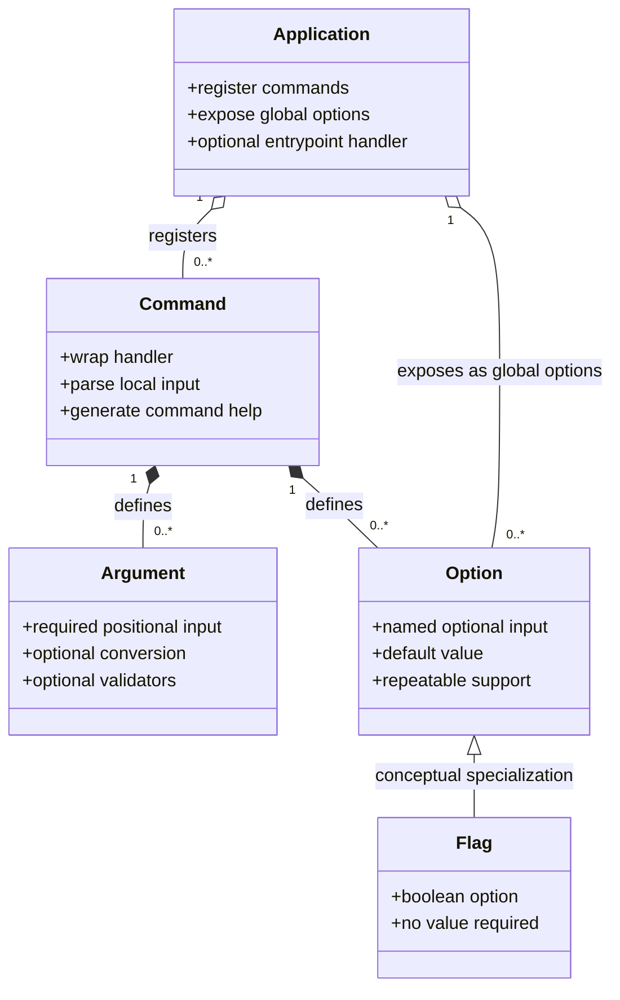
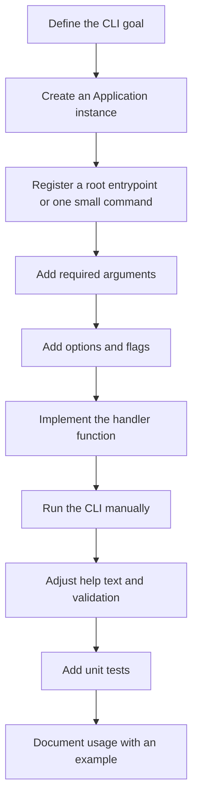
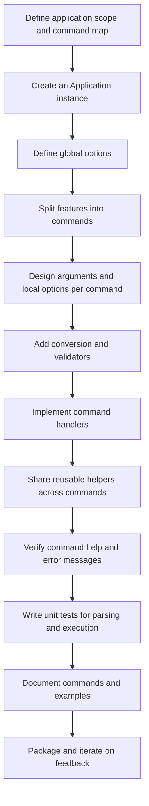

# quiCkLI

[](https://github.com/spmse/quickli/actions/workflows/ci.yml)
[](https://github.com/spmse/quickli/actions/workflows/coverage.yml)
[](https://www.python.org/)

quiCkLI is a simple Python CLI development framework.
Like Click, it is designed to be easy to use and allows further extension through a plugin
system.

The framework prioritizes simplicity for developers who are new to CLI development or who
want a small tool without the overhead of a larger framework.

It also serves as a learning resource for developers who want to understand CLI design,
software structure, and how to build their own tools from scratch.

The Python package name is `quickli`. The stylized project name is `quiCkLI`.

## Highlights

- commandless applications through `@app.entrypoint(...)`
- multi-command applications through `@app.command(...)`
- local and global options
- repeatable options and repeatable flags
- built-in validation for file paths, directory paths, positive numbers, and numeric ranges
- docstring-based help text fallback when `help_text` is omitted

## Philosophies

The very basic philosophy behind the library uses the following key concepts to create simple and intuitive CLIs:

- application: the instance of the program, which is responsible for managing the commands and their execution on the installed machine
- command: a single function of the application that performs a specific task, which can be executed by the user through the command line interface
- argument: arguments are input values that are passed to a command when it is executed, which can be used to customize the behavior of the command and provide additional (mandatory) information for its execution
- option: options are similar to arguments, but they are typically optional and provide additional functionality or customization for a command, which can be specified by the user when executing the command through the command line interface
    - flags: special type of option that does not require a value, but instead is interpreted as a boolean value (true or false) based on its presence or absence in the command line input
- plugin: a plugin is a separate module or package that can be added to the application to extend its functionality, which can include additional commands, options, or other features that are not included in the core application but can be easily integrated through the plugin system

## Concept Relationships

The following diagram shows how the core CLI concepts relate to each other.



In the current implementation, flags are represented as boolean options. They are shown
separately here to make the conceptual relationship easier to understand.

## Developer Workflows

The following workflow shows a typical path for building a small `quickli` application
with a single entrypoint or a very small command surface.



The next workflow shows a more structured approach for building a larger `quickli`
application with multiple commands and shared behavior.



## Project Structure

The repository follows a `src` layout for the Python package and keeps non-code assets in
separate directories.

- `src/quickli`: library source code
- `tests`: dedicated unit tests
- `examples/simple`: focused entry-level example applications
- `examples/complex`: larger example applications with multiple commands
- `specs`: technical specifications for the core resources
- `docs`: project documentation for users and developers
- `.github`: GitHub automation and AI guidance

## Documentation

- [Installation](docs/installation.md)
- [Usage](docs/usage.md)
- [Validation](docs/validation.md)
- [Developer Guide](docs/developer-guide.md)
- [GitHub Publishing Guide](docs/github-publishing-guide.md)
- [Open Source Release Notes](docs/open-source-release.md)

## ADRs

- [ADR 0001: Support Commandless Applications Through a Root Entrypoint](docs/adr/0001-commandless-entrypoint.md)

## Examples

- [Examples index](examples/README.md)
- [Simple: build a cat CLI with quickli](examples/simple/cat-cli/README.md)
- [Simple: build an ls CLI with quickli](examples/simple/ls-cli/README.md)
- [Simple: build a mkdir CLI with quickli](examples/simple/mkdir-cli/README.md)
- [Simple: build a head CLI with quickli](examples/simple/quickhead/README.md)
- [Complex: build `pyk5l`, a minimal kubectl-like CLI](examples/complex/pyk5l/README.md)

The complex `pyk5l` example demonstrates how `quickli` can model a kubectl-like
verb-resource interface without nested subcommand support in the framework itself.

```bash
PYTHONPATH=src python examples/complex/pyk5l/app.py get pods
PYTHONPATH=src python examples/complex/pyk5l/app.py get services --service-type NodePort
PYTHONPATH=src python examples/complex/pyk5l/app.py describe pod api-7d4f5f6b89-l2xq9
```

## Specifications

- [Application](specs/application.md)
- [Command](specs/command.md)
- [Argument](specs/argument.md)
- [Option](specs/option.md)
- [Plugin](specs/plugin.md)

## Current Scope

The current implementation provides a minimal but functional CLI framework with:

- application-level entrypoints for commandless tools
- optional named commands for multi-command CLIs
- argument, option, conversion, and validation resources
- generated help output with metadata and docstring fallback
- complex examples that illustrate kubectl-like command shapes through validated resource arguments
- unit tests, specifications, and runnable examples

## Release Model

- CI runs on pushes and pull requests.
- Coverage artifacts are built in a dedicated workflow.
- Releases are created only from Git tags matching `v*`.
- Python package publication is configured for PyPI rather than a GitHub Packages Python registry.

## Decisions

- The package and distribution name is `quickli`.
- The project is released under the MIT License.

## License

The project is licensed under the MIT License. See [LICENSE](LICENSE).

 