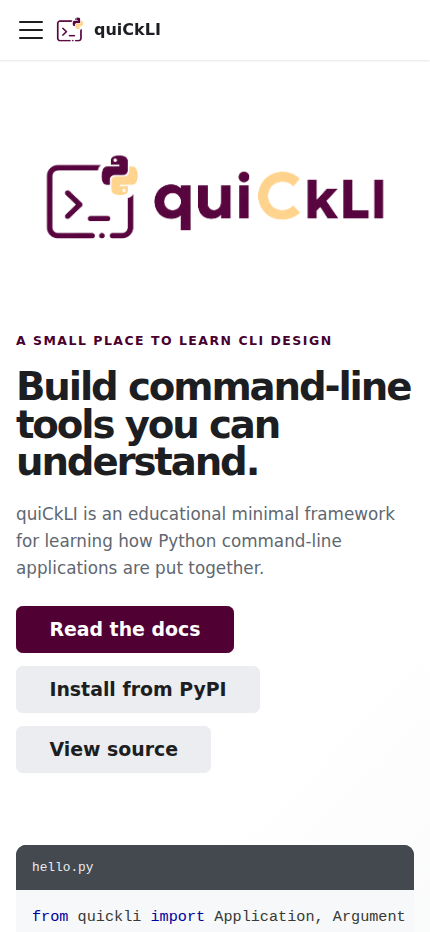

# quickli-docs

Documentation site for [quiCkLI](https://github.com/spmse/quickli), the minimal Python CLI framework.

Built with [Docusaurus](https://docusaurus.io/) and deployed to [GitHub Pages](https://spmse.github.io/quickli/).

## Development

From the repository root:

```sh
pnpm install
pnpm --filter quickli-docs start
```

Or from this directory:

```sh
pnpm install
pnpm start
```

## Build

```sh
pnpm build
```

## Mobile responsiveness screenshots (Issue #58)

The following screenshots show the same homepage hero area on mobile.

### Before


### After



## Deploy

Deployment to GitHub Pages is handled by CI. To deploy manually:

```sh
pnpm deploy
```

## Configuration highlights

- **i18n**: English as default locale; additional locales can be added to `docusaurus.config.ts`.
- **Mermaid**: Diagram support is enabled via `@docusaurus/theme-mermaid`.
- **Syntax highlighting**: Python, Shell (`bash`), PowerShell, HCL, Docker (container), and YAML (Kubernetes) are enabled in addition to the Docusaurus defaults.
- **AI discoverability**: `static/robots.txt` allows crawling of the documentation site and
  `static/llms.txt` provides a machine-readable project summary with links back to the
  canonical repository documentation and specifications.
